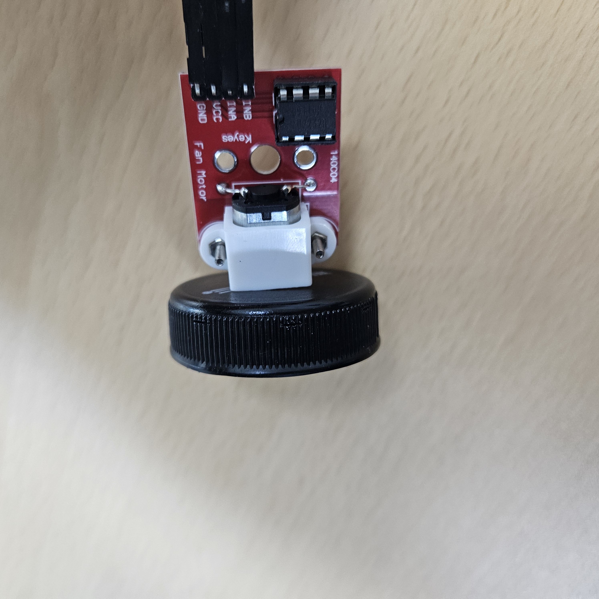
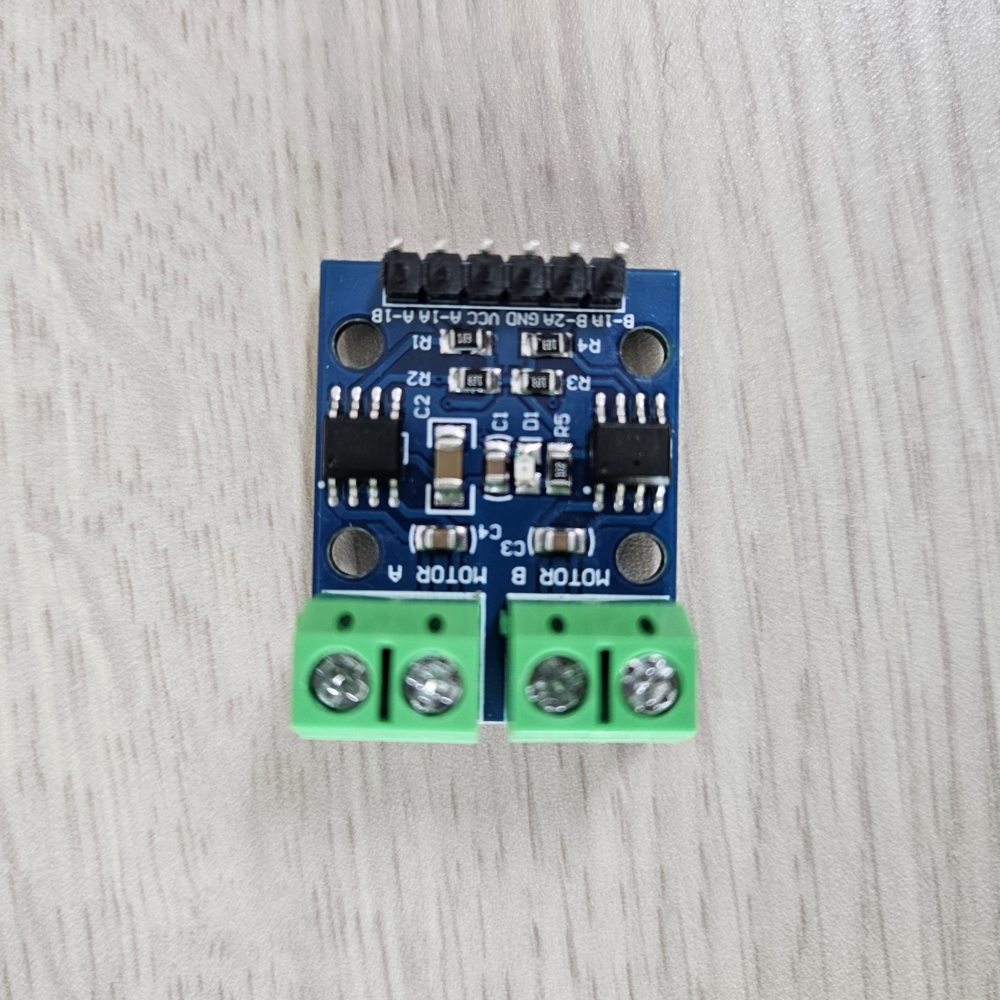
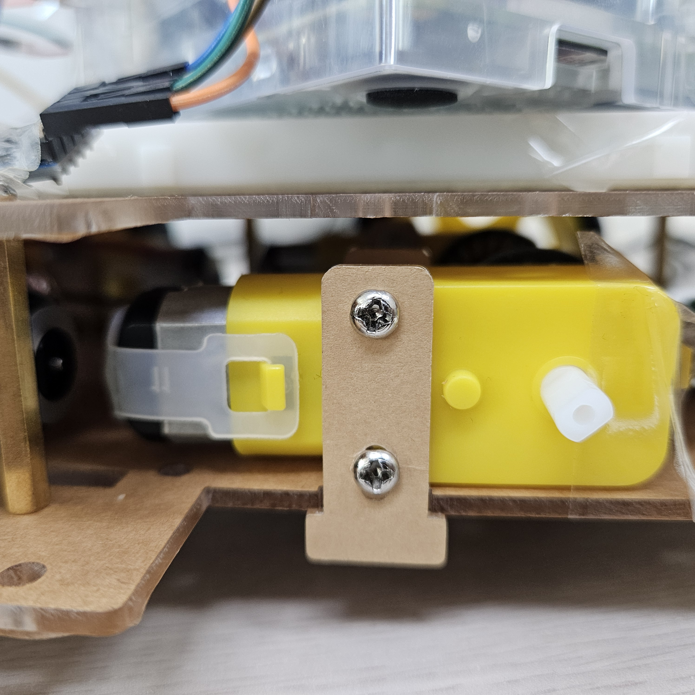
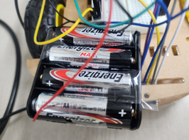

# 🚘 임베디드 시스템 - 대인 충돌 방지 자동차
### 1조 : 금동헌 김규성 김근호 배진우
***
### 목차
#### 1. 주제
#### 2. 전체적인 시스템 구조
#### 3. 구현
#### 4. 문제점 및 해결 방안
#### 5. 결과 및 느낀점
#### 6. 사용 가이드
#### 7. 활용 방안
***
### 1. 주제
 교통사고가 발생하는 주요 원인에 급발진이라는 요소가 존재함. 시간이 갈수록 이 급발진으로 의심 되는 교통 사고가 자주 일어나고 있지만 사고의 원인을 파악해보면 급발진이 아닌 **기기 조작 미숙**, **전방 주시 태만** 등 다양한 원인이 존재하였다. 전방 주시 태만, 기기 조작 미숙 등 이러한 원인들로 인하여 발생하는 사고를 방지하기 위해 **대인 충돌 방지 자동차**를 주제로 선정하였다.
***
### 2. 전체적인 시스템 구조

***
### 3. 구현

***
### 4. 문제점 및 해결 방안
 문제가 없이 회로를 구현하고 회로에 맞게 기능까지 정상적으로 동작하는것을 예상하였지만 생각보다 많은 부분에서 문제가 발생하였고 사고가 발생하였음.
##### 4-1 [ 바퀴 기능의 문제 ]
 바퀴를 구현하는 과정에서 발생한 문제는 원래 DC모터에 크기가 큰 뚜껑을 결합하여 바퀴로 사용할 계획이였으나 차체의 무게도 견디지 못하고 헛돌기를 반복하여 기존 계획으로 진행할 수 없게 되었다. 이 문제를 해결하기 위해 **DC모터 드라이브 모듈**과 그에 맞는 새로운 DC모터를 사용하는 것으로 테스트를 진행 해보았는데 정상적으로 동작하여 이 방법으로 문제를 해결할 수 있었다.
##### 4-2 [ 사람 인식의 문제 ]
 사람을 인식하기 위해 Opencv를 계획하였지만 실제로 사용해본 결과 사람을 인식하는 과정이 라즈베리파이의 **카메라 모듈**보다 인식률이 좋지 않은 것을 확인하여 Opencv를 사용하지 않고 라즈베리파이의 카메라 모듈을 사용하는 것으로 계획을 변경하였다. 
##### 4-3 [ 회로 쇼트 ]
 DC모터를 구동하는 과정 중 모터의 출력값을 테스트하는 과정에서 값이 0~100으로 설정이 가능할 때 정상적으로 동작하는지 테스트하는 과정에서 **50을 초과하는 값**으로 여러 DC모터를 테스트하는 과정 중 DC모터 드라이버 모듈에 연기가 나며 회로가 타고 모듈이 쇼트가 나서 사용 불능이 되어버리는 사태가 발생하였다. 위 문제점으로 인해 시스템 모터의 최댓값을 제한할 수 있게 되었으며 쇼트난 드라이버 모듈은 사용이 불가능해졌지만 모듈을 추가적으로 준비해놨기에 진행에 문제는 없었다.
##### 4-4 [ 전력 문제 ]
 대인 충돌 방지 자동차를 다 만든 후 정상적으로 기능들이 동작하는지 테스트하는 과정에서 바퀴가 2개만 사용되는 좌회전, 우회전, 바퀴를 멈추는 정지는 정상적으로 동작하지만 바퀴를 4개 모두 사용하는 직진과 후진은 지상에서는 잘 가지 않는 현상이 있었다. 기능 자체의 문제일 수 있어 차체를 들고 직진, 후진의 기능을 사용해본 결과 바퀴가 정상적으로 움직이는 모습이 확인되는 것을 보고 바퀴에 전달되는 전력의 문제라는 것을 파악하고 보조전력을 공급하는 것으로 문제를 해결하기 위해 시도하였다. 바퀴에 보조전력을 연결한 결과 문제없이 지상에서 직진, 후진이 항상 잘 되는 모습은 아니지만 이전보다는 모든 기능들이 수월하게 동작하는 모습을 볼 수 있었다.

  
  
  
  

***
### 5. 결과 및 느낀점
 휴대폰의 **블루투스 기능**을 이용하여 자동차에 명령을 내릴 수 있으며 직진, 좌회전 등 차가 움직이는 동작을 하고 있는 경우에 전방에 달려있는 카메라 모듈에 **사람이 인식**될 때 초음파 센서로 그 사람과의 **거리를 측정**하여 시스템에서 설정한 거리보다 가까워질경우 차의 동작을 멈추도록 한다. 이는 카메라 모듈 자체는 거리가 멀어도 사람을 인식할 수 있지만 사람과의 거리가 충돌 가능성이 없는 수십~수백미터의 경우인 경우는 멈출 필요가 없기에 초음파 센서로 거리를 측정하여 임의로 설정한 거리 내에 사람이 있을 경우 차의 주행 동작을 멈추도록 설정하였다. 사람이 감지되어 차의 동작이 멈추는 경우에 프로그램에 사람과의 측정된 거리의 정지 되었다는 명령을 남긴다.   
 Opencv가 사람을 인식하는 기능이 좋지 않아서 라즈베리파이의 카메라 모듈로 변경하여서 기능을 구현하였지만 라즈베리파이의 카메라 모듈 또한 인식은 된다 하여도 그 성능이 뛰어나지는 않다. 실제 카메라 프레임은 **1프레임**이 겨우 나올까 한 정도이다. 만약 카메라가 더 좋은 성능을 낼 수 있었다면 갑자기 차 앞으로 뛰어드는 사람도 감지하여 대처할 수 있는 기능 또한 구현이 가능하였을텐데 그것이 불가능한 것이 아쉬움이 남으며 또 바퀴의 성능에 대해서도 하나의 아쉬움이 남는다. 보조전력을 사용해서 동작이 잘 되도록 하였지만 차체의 무게도 있고 전력이 더 잘 공급되고 모터와 카메라의 성능이 더 좋다면 지금 구현된 대인 충돌 방지 기능을 더 퀄리티 높게 구현할 수 있을것이라 생각한다. 이렇게 아쉬움도 많았지만 그래도 초반에 기존 DC모터의 성능 문제를 빠르게 발견하고 대처할 방안을 탐색하고 시스템이 완성되었을 때 사람 감지, 바퀴 동작 등 기능은 동작하지만 차가 지상에서 동작할 때 문제가 생기는 것을 보고 이 또한 문제를 파악하고 해결하기 위한 방법을 탐색하고 그것을 실행에 옮기며 문제점을 파악하는 과정, 그 문제점을 해결하는 과정을 팀원과 함께 해결해나가며 **대처 능력**을 키우고 **협업의 중요성**을 느낄 수 있었다.

데모 영상은 다음 하이퍼링크 또는 Github의 Images파일의 **demo.mp4**파일을 다운로드 해서 확인할 수 있습니다.   
[대인 충돌 자동차 Demo 영상 바로가기](https://youtube.com/shorts/q5PLEvD-QTo?feature=share)

***
### 6. 사용가이드
1. people_detection 파일을 실행한다.
2. safety_system 파일을 실행한다.
3. 모바일 기기에 설치된 Serial Bluetooth Terminal파일을 실행한 후 시스템과 연결한다.
4. (초기 세팅일 시)어플의 매크로 함수를 설정한다.   
**4-1**. M1~M7까지 기본 세팅이 있는데 M1부터 차례대로(**순서 상관 X**) Name[ Go, Right, Left, Stop, Back ] , Value [ 1, 2, 3, 4, 5 ] , Edit mode : 초기값 그대로( Text ), Action : 초기값 그대로 ( Send ) , Repeat 체크 X로 설정한다.
5. 설정된 매크로 함수를 하나하나씩 체크하며 잘 동작하는지, 대인 감지 기능은 문제 없이 잘 동작하는지 확인한다.
***

### 7. 활용 방안
1. 현재 구현된 대인 충돌 방지 자동차는 전면부에만 달려있으니 이 기능 그대로 후방에 설치할 경우 후진을 하는 경우에도 **대인 충돌 방지 기능**을 사용할 수 있다.
2. 초음파 센서의 거리 측정 기능을 활용하여 사람 뿐 아니라 벽, 자동차 등 부딪히면 위험한 물체를 파악한 후 **안전거리**를 계산하여 그 거리를 유지하도록 한다.   
**2-1**. 초음파는 거리만 측정이 가능하니 물체를 감지할 수 있는 센서, 대표적으로 라이다(**Light Detection and Ranging**)로 변경하여 사용하거나 함께 사용하도록 하면 기능의 퀄리티가 더 좋아질것이다.
3. 사람을 감지하고 일정 거리가 되면은 정지하는 것이 아닌 거리를 다양하게 설정하여 급정지가 아니라 **주행 속도를 조절**하는 식으로 변경할 수 있다.
4. 대인 충돌 방지 기능이 동작 할 때 차가 정지 또는 속도가 느려지게 되므로 기능이 동작하고 있다는 것을 알리기 위해 **후방 LED를 점등**하는 기능도 함께 추가하면 뒤에 따라오는 차와 충돌 사고 또한 방지할 수 있다.
